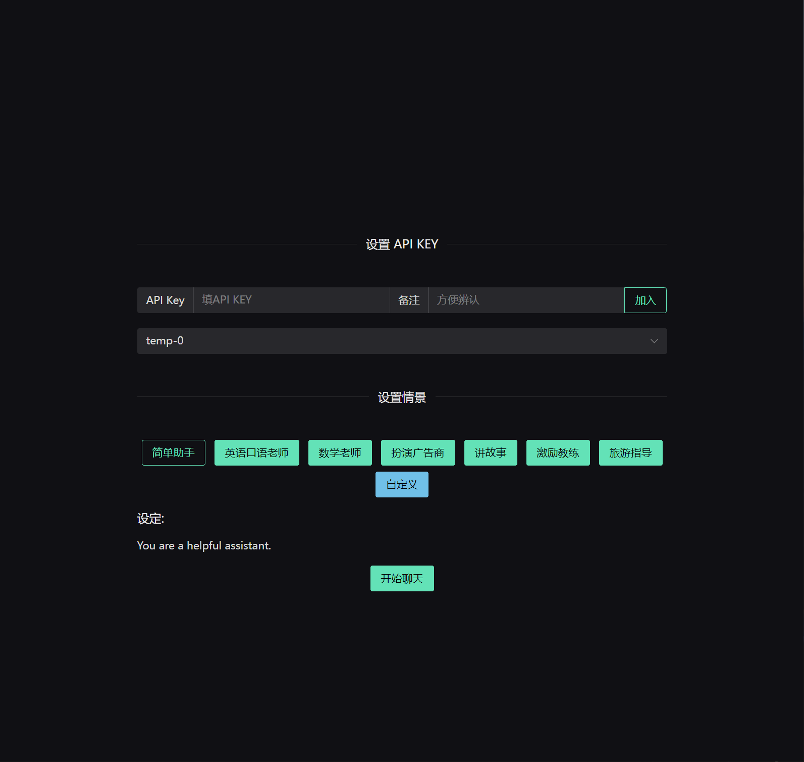
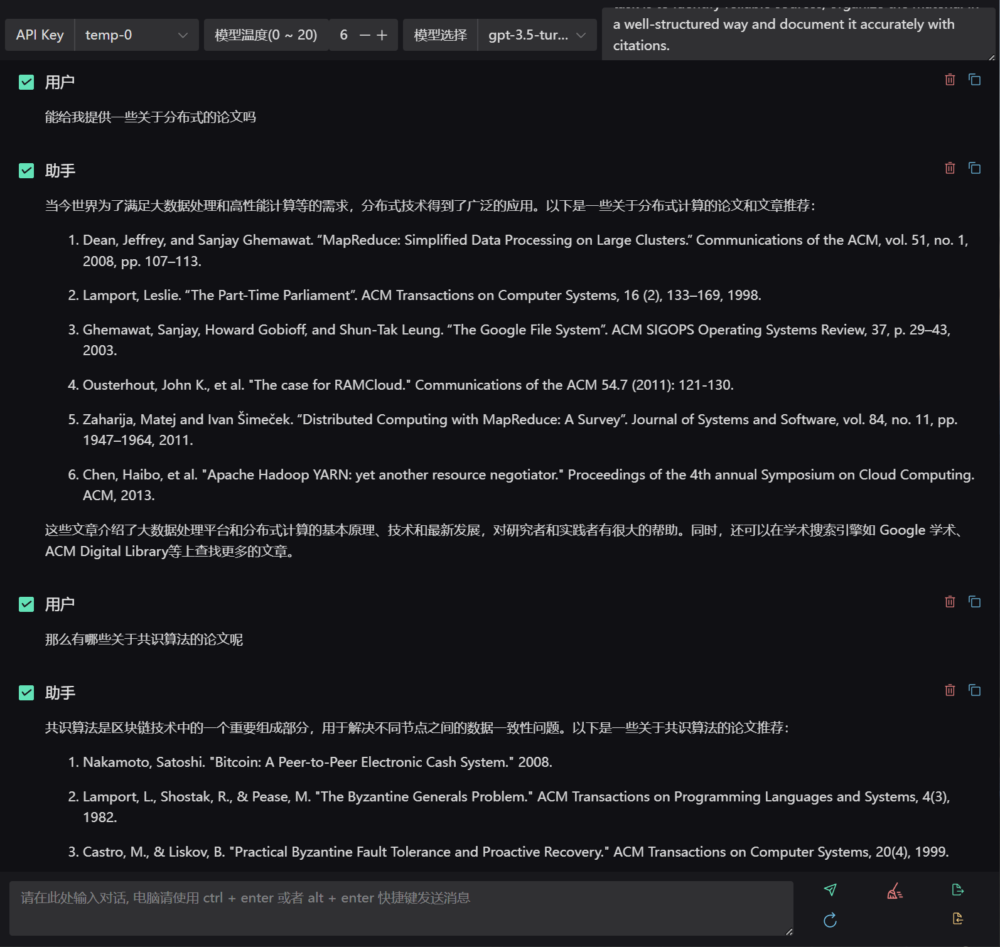

# Over View [](https://drone.whileaway.io/ThisSeanZhang/gpt-ui)
A Very Simple GPT API UI 

# Demo



# Plan
- [x] 可以使用自己的 API key
- [x] 可以自定义想要的设定
- [x] 可以选择哪些作为对话上下文
- [x] 支持对话的导出导入
- [x] 优化 UI

# Next
- [ ] 支持模型的选择(目前只能选 gpt-3.5-turbo)
- [ ] 支持其他 API
...

# Deploy
## Docker Image
```shell
docker pull thisseanzhang/gpt-ui:0.0.3

docker run --rm -p 65525:65525 thisseanzhang/gpt-ui:0.0.3
```

if want more info
```shell
docker run --rm thisseanzhang/gpt-ui:0.0.3 ./backend --help

Usage: backend [OPTIONS]

Options:
  -w, --web-path <WEB_PATH>
      --addr <IP:PORT>        [default: 0.0.0.0:65525]
      --log-level <LogLevel>  [default: info]
  -h, --help                  Print help

```
## Compose

```conf
# .env
GPT_UI_TAG=0.0.3
```

```yaml
# docker-compose.yaml file
version: "3.5"
services:
  gpt-ui:
    image: thisseanzhang/gpt-ui:${GPT_UI_TAG}
    ports:
      - "65525:65525"
```

# License
This project is licensed under [MIT license](https://github.com/ThisSeanZhang/gpt-ui/blob/main/LICENSE).
